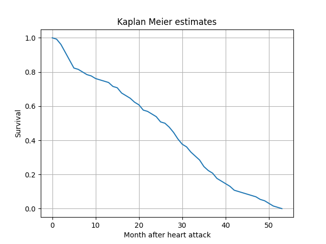

# Introduction
KM estimator is implemented at the moment

# How to use
- `pip install -r requirements.txt`
- `python kaplan_meier.py`
  

# Data: [Echocardiogram data set in UCI](https://www.kaggle.com/loganalive/echocardiogram-uci)
- Data Set Information
  All the patients suffered heart attacks at some point in the past. Some are still alive and some are not.
  The survival and still-alive variables, when taken together, indicate whether a patient survived for at least one year
  following the heart attack.

- Columns
  - survival: the number of months patient survived (has survived, if patient is still alive). Because all the patients
    had their heart attacks at different times, it is possible that some patients have survived less than one year but
    they are still alive. Check the second variable to confirm this. Such patients cannot be used for the prediction
    task mentioned above.
  - still-alive: a binary variable. 0=dead at end of survival period, 1 means still alive
  - age-at-heart-attack: age in years when heart attack occurred
  - pericardial-effusion: binary. Pericardial effusion is fluid around the heart. 0=no fluid, 1=fluid
  - fractional-shortening: a measure of contracility around the heart lower numbers are increasingly abnormal
  - epss: E-point septal separation, another measure of contractility. Larger numbers are increasingly abnormal.
  - lvdd: left ventricular end-diastolic dimension. This is a measure of the size of the heart at end-diastole. Large
    hearts tend to be sick hearts.
  - wall-motion-score: a measure of how the segments of the left ventricle are moving
  - wall-motion-index: equals wall-motion-score divided by number of segments seen
  - alive-at-1: Boolean-valued. Derived from the first two attributes. 0 means patient was either dead after 1 year or
    had been followed for less than 1 year. 1 means patient was alive at 1 year.
    - variable alive-at-1 is highly imbalanced

- Reference
  - https://www.kaggle.com/loganalive/echocardiogram-dataset-uci